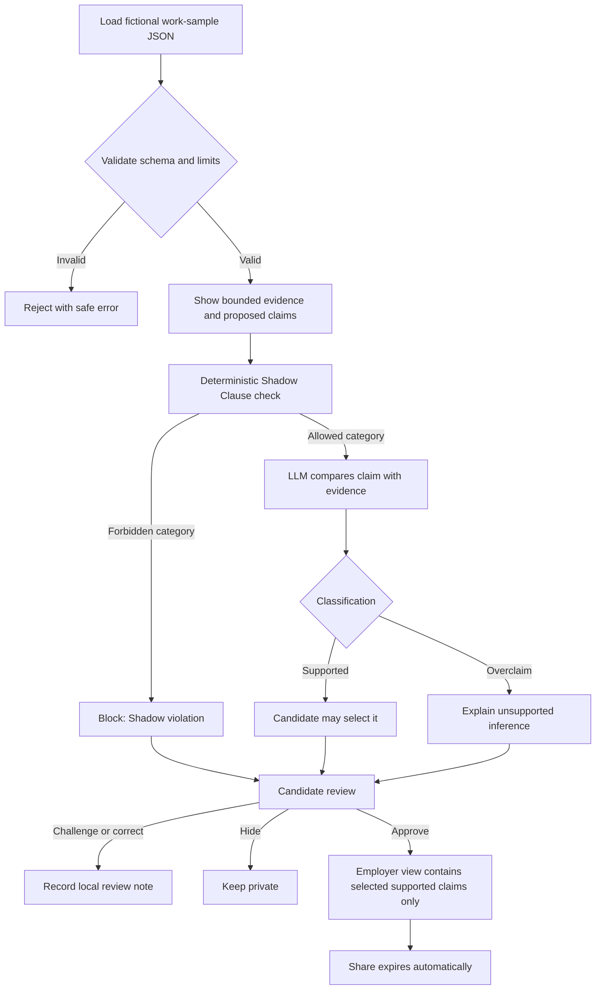
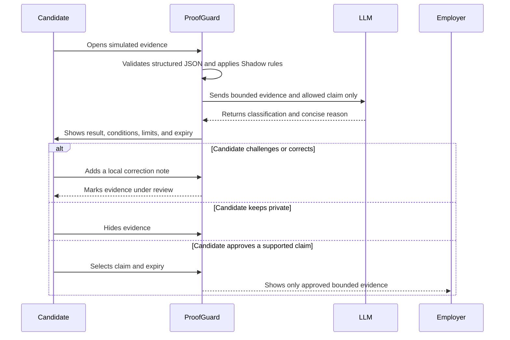

# ProofGuard - Week 4 Business Bending Packet

## Problem, user, and success

AI can make work samples and skill evidence cheaper, but one successful task does not prove who a person is or what they will become. The risk appears after evidence is created: a bounded result can be stretched into claims such as "job-ready," "high potential," or an employability score. ProofGuard asks: **how can demonstrated skill be useful to employers without becoming a permanent judgment about the candidate?**

The primary user is a young Mexican candidate seeking an entry-level opportunity through demonstrated skill rather than only a degree or previous job title. V1 uses only **Sofía Martínez, age 20, a fictional candidate**, and a simulated entry-level auxiliar-contable CFDI audit.

> Before the module closes, ProofGuard can take one simulated auxiliar-contable work-sample record, validate it, evaluate employer-facing claims against bounded evidence, block Shadow-Clause violations, explain each result, and let the candidate control which supported evidence is released and when it expires.

## What I am building

ProofGuard is an adversarial evidence-checking layer between a proof-of-skill task and an employer-facing view. It combines structured JSON, deterministic Shadow Clause rules, and an LLM to classify proposed claims as **SUPPORTED** (bounded to what was observed), **OVERCLAIM** (broader than the evidence), or **SHADOW VIOLATION** (converts evidence into identity, personality, aptitude, employability, potential, career, or destiny). The candidate sees the reason, can challenge/correct the record, can hide evidence, chooses what is shared, and sets an expiry. Missing or unshared evidence is never presented as negative evidence.

## Image-generated mockup


The generated screen is a design reference. All people, evidence, results, and AI outputs shown in the prototype are simulated.

## Structured evidence example

```json
{
  "recordId": "pg-demo-001",
  "fictional": true,
  "candidate": { "displayName": "Sofía Martínez", "age": 20 },
  "assessment": "Auxiliar contable - Auditoría de CFDI",
  "task": "Revisar CFDI clasificados por IA, identificar errores y explicar una corrección",
  "result": { "correct": 8, "total": 10 },
  "aiAssistance": "Sugerencias de clasificación visibles",
  "conditions": "Muestra simulada; no prueba autoría independiente ni desempeño laboral general",
  "provenance": "Demostración local ProofGuard; rúbrica v1.0",
  "evidenceDate": "2026-09-06",
  "expiresAt": "2027-03-06"
}
```

## Feature flow



## Swimlane



## Benchmark line

**Best existing direction:** Opportunity@Work's STARs work pushes employers to recognize skills gained through alternative routes; Europass Digital Credentials makes issuer and record authenticity verifiable.

**How mine differs/localizes:** ProofGuard is a narrower Mexican trust layer that tests the language built on top of a single receiver-defined work sample, preserves its conditions and limitations, and blocks it from becoming a global judgment.

## Three-year long view

In three years, ProofGuard could become a trust layer between Mexican work-sample providers and employers. Candidates could hold separate, atomic pieces of evidence with visible provenance, conditions, corrections, and expiry rather than one permanent profile. Its value would be helping employers trust what someone demonstrated while preventing old evidence from narrowing future opportunities.

## Load-bearing Blueprint conditions

1. Evidence stays bounded to the completed task and states conditions, permitted AI assistance, provenance, and limitations.
2. No claim says certified, job-ready, independently authored, or predicts long-term performance unless separately proven.
3. Deterministic scoring and a public versioned rubric are favored; partners cannot pay to change criteria.
4. The experience is Spanish-first, responsive, and usable without webcam surveillance or AI cheating detection.
5. The candidate owns sharing. Private or missing evidence is never negative evidence. A correction/challenge path exists.
6. **Shadow Clause:** no permanent potential, personality, aptitude, employability, or ranked-destiny scores; inferences expire; employers never receive discarded paths or private predictions.
7. Receiver recognition remains unproven. The kill criterion remains fewer than 5 of 20 despacho owners willing to use the signal for pre-screening.

## Scope cut

V1 is not an AI tutor, career recommendation engine, hiring decision system, candidate ranking tool, employability score, personality or aptitude predictor, universal skills passport, real CFDI assessment, proctoring system, ATS integration, credential issuer, marketplace, or database of personal information.

## Architecture and stack

| Layer | Choice | Purpose |
|---|---|---|
| Interface | React + TypeScript + shadcn primitives | Spanish-first candidate and employer views |
| Structured data | Local typed JSON | One fictional evidence record; no personal-data storage |
| Validation | Server and client allowlists, types, and length limits | Reject malformed or unexpected input |
| Guardrails | Deterministic server-side rules | Block Shadow categories before any LLM call |
| AI | Server-side LLM call with a labeled simulated fallback | Semantic overclaim analysis; never hiring or scoring |
| Candidate state | In-memory browser state only | Sharing, corrections, and expiry disappear on refresh |
| Hosting | OpenAI Sites | Two staged deployments on a free stack |
| Secrets | Hosted environment variable only | No key in source, client code, history, or logs |

## Test plan

### Mechanical pass

1. The fictional record renders from JSON and is visibly labeled simulated/fictional.
2. Malformed, oversized, or unexpected inputs are rejected.
3. A bounded observed-result claim is supported; a job-readiness claim is an overclaim.
4. Potential, employability, personality, aptitude, career-ranking, or destiny language is a Shadow violation.
5. Reasons mention the exact evidence boundary.
6. Only supported claims can be selected and shared.
7. Hiding evidence empties the employer view without implying a negative result.
8. A correction/challenge can be entered and marks the record under review.
9. Expired sharing is unavailable to the employer view.
10. No API key or real personal information exists in the repository or browser bundle.
11. Keyboard, narrow-screen, empty, error, and success states remain understandable.
12. Log at least one genuine defect, fix it, and redeploy.

### Persona pass

Use a fresh synthetic persona modeled on a 20-year-old Mexican entry-level candidate who uses a phone, distrusts opaque hiring systems, and worries that one mistake will define her. Walk through screenshots one screen at a time; log what she thinks will be shared, whether she feels judged, where she hesitates, and where she would quit. Fix the single worst confusion and record the before/after decision.

